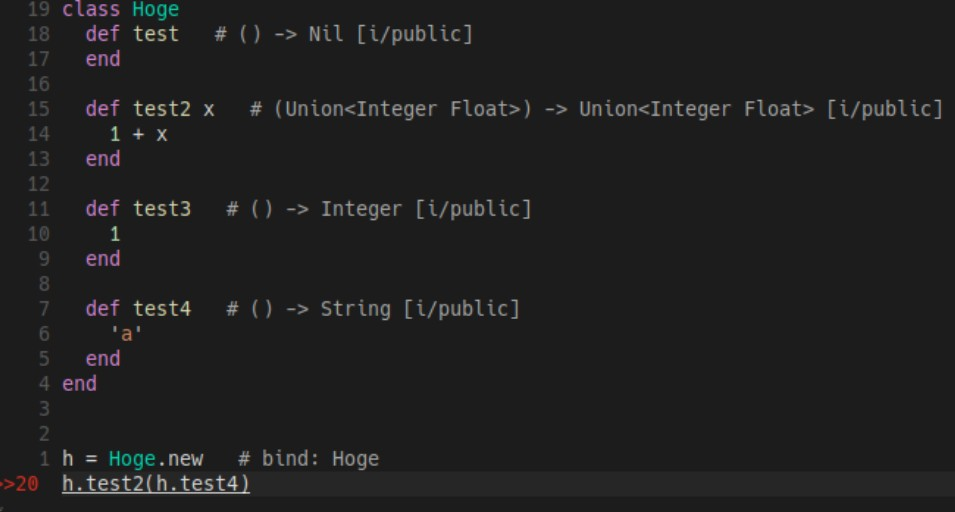

# Ruby-TI LSP

Language Server Protocol (LSP) implementation for Ruby-TI static type analyzer.

## Overview

Ruby-TI LSP provides IDE features for Ruby code using the Ruby-TI type analyzer:

- **Code Lens**: Inline type signature display
- **Code Completion**: Auto-complete method suggestions based on type inference
- **Go to Definition**: Jump to method and class definitions
- **Diagnostics**: Real-time type error detection



## Requirements

- Go 1.24.5 or later
- [Ruby-TI](https://github.com/engneer-hamachan/ruby-ti) installed and available in PATH as `ti` command

## Installation

```fish
# This will build the `ti-lsp` binary and install it to `./bin/ti-lsp`.
make install
```

```fish
# setting binary path
# fish example
set -x PATH "/path/to/ruby-ti-lsp/bin:$PATH"
```

## Usage

#### Neovim

Use your preferred LSP plugin. Example configuration for coc.nvim:

```json
{
  "codeLens.enable": true,
  "codeLens.position": "eol",
  "codeLens.separator": "  #",
  "languageserver": {
    "ruby-ti": {
      "command": "ti-lsp",
      "filetypes": ["ruby"]
    }
  }
}
```

#### VSCode

Install the VSCode extension:

```bash
code --install-extension vscode/ruby-ti-lsp-0.1.0.vsix
```

## Features

### Code Lens

Displays inferred type signatures inline at method definitions.


### Code Completion

Type-aware method suggestions powered by Ruby-TI's static type inference.

### Go to Definition

Navigate to method and class definitions across your codebase, following inheritance hierarchies.

### Diagnostics

Real-time type error detection. The LSP server automatically runs Ruby-TI on document changes and displays type errors inline.


## License

MIT License - see [LICENSE](LICENSE) file for details.

### Third-Party Libraries

This project uses the following third-party libraries:

- [glsp](https://github.com/tliron/glsp) - Licensed under Apache License 2.0
- [commonlog](https://github.com/tliron/commonlog) - Licensed under Apache License 2.0
- [kutil](https://github.com/tliron/kutil) - Licensed under Apache License 2.0

See the respective repositories for full license texts.
